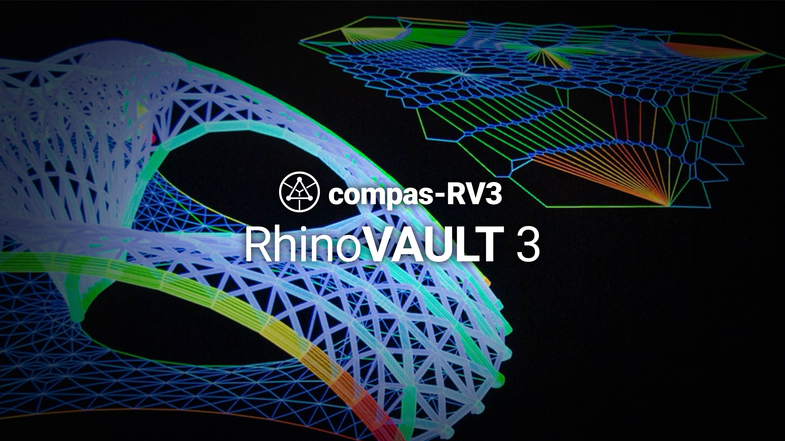

# compas-RV3 (RhinoVAULT 3)

compas-RV3 (RhinoVAULT 3) is an implementation of RhinVAULT for Rhino 6+, based on the COMPAS framework.

## Getting Started

compas-RV3 is available as installable plugin for Rhino(6+).
Installation instructions are available in the docs: [Installation](https://blockresearchgroup.gitbook.io/compas-rv3/documentation/dev-installs)

## First Steps

The [User Manual](https://blockresearchgroup.gitbook.io/compas-rv3/documentation/user-manual) is a good place to start.

## Questions and feedback

compas-RV3 has a dedicated [post category on the COMPAS forum](https://forum.compas-framework.org/c/RV3) for questions and discussions.

## Issue tracker

If you find a bug, please help us solve it by [filing a report](https://github.com/BlockResearchGroup/compas-RV3/issues).

## Contributing

If you want to contribute, please contact the development team.
